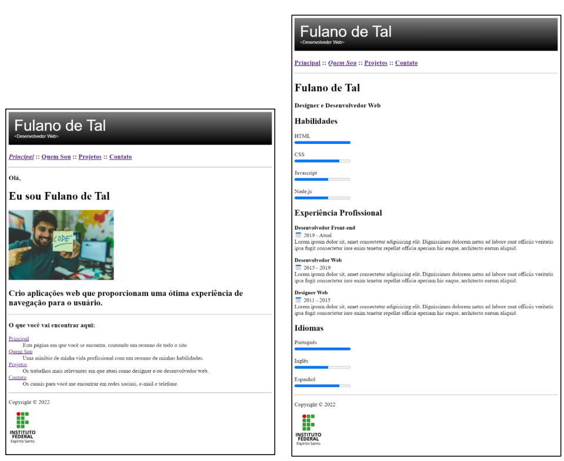
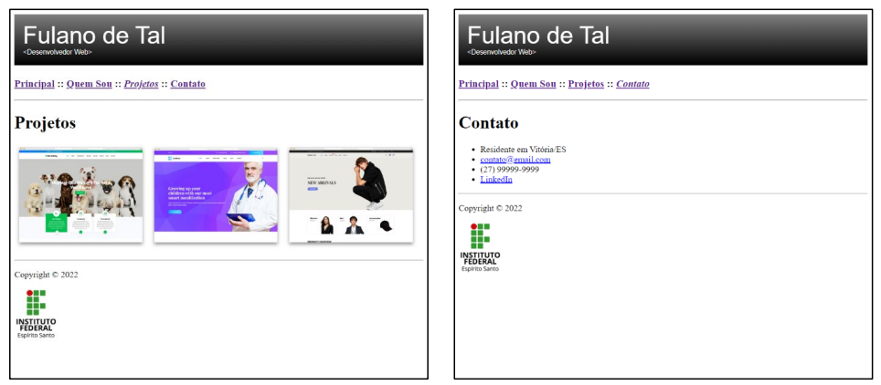

# Atividade Prática da Semana 1

## Instruções

1) Um dos sites mais importantes para um programador profissional é aquele para expor o seu portfólio. Tratase de algo essencial para ser notado e para estabelecer sua presença online, mostrando habilidades, projetos
em que participou e disponibilizando canais para contato. Um portfólio pode te ajudar a encontrar um
trabalho, um estágio ou um programa de bolsa de estudos. Portanto, vamos entender como se constrói um
site de portfólio simples.
2) Um site de portfólio deve ter ao menos 4 elementos essenciais: uma hero section, que é uma seção que mostra
de forma destacada o perfil do profissional e convida o usuário a alguma ação; uma seção com informações
sobre as habilidades relevantes do profissional; uma seção informando os projetos mais relevantes em que o
profissional já atuou; e, por fim, uma seção que apresente todos os canais de contato possíveis para se
comunicar com o profissional.
3) As imagens a seguir são de um site de portfólio pessoal que usa somente os elementos HTML que foram vistos
ao longo do conteúdo dessa semana. Crie um site com 4 páginas visualmente idênticas às das figuras
mostradas ao fim desse documento. Lembre-se de usar as boas práticas mencionadas ao longo das aulas,
incluindo a preocupação com a semântica dos elementos HTML. Abaixo do enunciado da atividade, na sala
virtual, tem um link para download das imagens utilizadas nesse projeto. Agora vamos a algumas dicas
importantes que você deve observar ao construir as páginas:
- 1) O cabeçalho é uma imagem SVG que está entre as imagens desse projeto. Essa imagem deve ser
aberta em modo texto para que seja possível substituir o nome “Fulano de Tal” pelo seu nome e para
trocar as cores do degradê.
- 2) Cada item do menu deve abrir a página correspondente ao seu título e deve ficar em itálico quando
corresponder à página corrente.
- 3) Substitua a foto da página principal por outra de sua preferência. De preferência, use uma foto sua.
Se não tiver uma boa foto no momento, você pode encontrar outras boas fotos em
https://www.pexels.com/ .
- 4) As barras de progresso usadas na página “Quem Sou” usam o elemento HTML <progress> com valor
mínimo de 1 e valor máximo de 5. Como os vídeos não abordaram esse elemento, pesquise sobre ele
para utilizá-lo corretamente.
- 5) As imagens de calendário da página “Quem Sou” usam a entidade HTML “&#x1f4c5;” .

4) Agora veja, no restante desse documento, as capturas de tela das páginas prontas e dê o seu melhor para
conseguir reproduzir o que é mostrado. Bons estudos

5) Enunciado completo da atividade : [Download](./enunciado_completo_pratica01.pdf)

6) Imagens Usadas na Criação do Site : **Baixar do AVA**

7) Capturas de Tela das Páginas do Site a ser Criado

